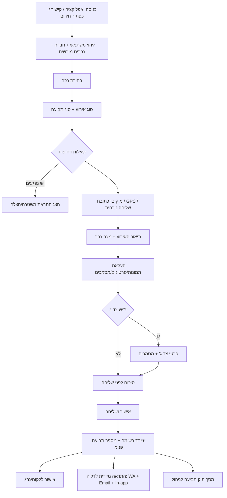

# דוח אפיון מלא — תהליך פתיחת תביעה / תקלה / אירוע דחוף

**תאריך:** 2026-07-18  
**סביבה שנבדקה:** `future-craft-core-STAGING` (קוד + migrations + types)  
**היקף:** בדיקה ואפיון בלבד — **ללא פיתוח, ללא Deploy, ללא שינוי Production**  
**יעד התראות (עתידי):** `orin1607@gmail.com` · `0534338601`

---

## מסקנה במשפט אחד

**אין במערכת מודול תביעות ביטוח.** קיים ניהול תפעולי של **תקלות** ו**תאונות** עם שמירה ל-DB, תמונות, מייל למנהלי צי והתראה in-app — בסיס טוב להרחבה, אך רחוק מהתהליך המלא שתואר.

---

## 1. מה כבר קיים במערכת בפועל

| רכיב | קיים? | פירוט אמת |
|------|--------|-----------|
| טבלת `faults` | כן | דיווח תקלה, urgency, status, images, towing_* |
| טבלת `accidents` | כן | דיווח תאונה בסיסי, has_insurance, third_party, images |
| טבלת `claims` / תביעות | **לא** | לא קיימת במסד / בקוד |
| מספרי סידורי לתקלה (`serial_id`) | עמודה קיימת | **לא מאוכלסת** ביצירה |
| צ'אט תקלה | כן | `fault_messages` + Realtime |
| יומן סטטוס תקלה | כן | `fault_status_log` |
| הפניות לספק | כן | `fault_referrals` |
| גרירה | חלקי | שדות על `faults` + מסך `/towing` + שדות ב-`service_orders` |
| חירום WhatsApp/טלפון | כן | `/emergency`, `emergency_categories`, `emergency_logs` |
| התראת מייל | כן | Edge `notify-accident-email` (Resend) |
| התראת in-app | כן | Trigger → `driver_notifications` |
| WhatsApp API (Gupshup) | כן | `send-whatsapp-message` — **לא** נקרא אוטומטית בפתיחת תאונה/תקלה |
| Storage תמונות | כן | bucket `documents` |
| פתיחה ע״י נהג / מנהל צי / super_admin | כן | RLS + מסכים |

---

## 2. אילו מסכים קיימים

| נתיב | רכיב | תפקיד |
|------|------|--------|
| `/faults` | `Faults.tsx` | רשימה + טופס + פרטי תקלה (צ'אט, גרירה, הפניה, סטטוס) |
| `/accidents` | `Accidents.tsx` | רשימה + טופס + פרטי תאונה |
| `/towing` | `Towing.tsx` | ריכוז בקשות גרירה |
| `/emergency` | `Emergency.tsx` | כפתורי חירום (טלפון / wa.me) |
| `/emergency-settings` | `EmergencySettings.tsx` | הגדרת קטגוריות חירום |
| `/alerts` | `Alerts.tsx` | התראות צי (כולל תקלות דחופות) — **לא** רשימת תאונות |
| `/driver-notifications` | `DriverNotifications.tsx` | תיבת התראות in-app |
| `/admin/modules/accidents` | Module admin | הגדרות מודול |
| `/admin/modules/accidents/required-fields` | Required fields | **לא מחובר** לטופס בפועל |
| Vehicle Hub → דיווח תקלה/תאונה | `VehicleActionModal` | פתיחה מקוצרת מרכב |
| Dashboard נהג | `DriverDashboard` | קיצורי דרך ל-`/faults`, `/accidents`, `/emergency` |

**אין מסך:** תביעות, תיק תביעה ביטוחי, אשף פתיחה בשלבים, ניהול שמאי/מוסך לתיק.

---

## 3. אילו טבלאות ושדות קיימים

### 3.1 `accidents` (14 שדות)

`id`, `date`, `vehicle_plate`, `driver_name`, `location`, `description`, `has_insurance`, `third_party`, `estimated_cost`, `images`, `status`, `notes`, `company_name`, `created_at`, `created_by`

### 3.2 `faults`

בסיס: `id`, `serial_id`, `date`, `driver_name`, `vehicle_plate`, `fault_type`, `description`, `urgency`, `status`, `notes`, `company_name`, `created_at`, `created_by`, `images`  
גרירה: `towing_required`, `towing_approved`, `towing_approved_by`, `towing_approved_at`, `towing_completed`, `towing_completed_at`

### 3.3 טבלאות נלוות

- `fault_messages`, `fault_status_log`, `fault_referrals`
- `emergency_categories`, `emergency_logs`
- `driver_notifications`
- Document-request types: `accident_document`, `surveyor_report` (קטלוג — לא מחובר לטופס תאונה)

### 3.4 מה אין בסכמה

מספר תביעה פנימי / מספר תביעת ביטוח, סוג אירוע מורחב, סוג תביעה, GPS, נפגעים, צד ג' מפורט, משטרה, שמאי, מוסך, רכב חלופי, חילוץ, סטטוס רכב נפרד, audit log כללי לתאונות, וידאו/אודיו כסוג קובץ מובנה.

---

## 4. מה עובד באופן מלא

1. יצירת תקלה → נשמרת ב-`faults` עם `company_name` + `created_by`.
2. יצירת תאונה → נשמרת ב-`accidents`.
3. העלאת תמונות דרך `MultiImageUpload` → Storage `documents` → מערך URL ב-`images`.
4. שינוי סטטוס תקלה ע״י מנהל + כתיבה ל-`fault_status_log`.
5. צ'אט תקלה בזמן אמת (`fault_messages`).
6. אישור/השלמת גרירה על תקלה.
7. קריאה ל-`notify-accident-email` אחרי תאונה חדשה (תמיד) ואחרי תקלה דחופה/קריטית.
8. Trigger DB יוצר התראות in-app למנהלי הצי באותה חברה.
9. נהג יכול לפתוח תקלה ותאונה מהדשבורד.
10. מנהל צי / super_admin יכולים לנהל סטטוסים ולמחוק (לפי RLS).

---

## 5. מה קיים אבל לא מחובר

| פריט | בעיה |
|------|------|
| `faults.serial_id` | עמודה קיימת, לא מוגדרת ביצירה |
| Required-fields למודול accidents (`severity`, `police_report`, `accident_date`) | UI אדמין קיים; **העמודות והטופס לא תומכים** |
| `send-whatsapp-message` (Gupshup) | עובד כתשתית; **לא** מופעל בפתיחת תאונה/תקלה |
| WhatsApp חירום (`wa.me`) | ידני בלבד — לא התראה אוטומטית לדליה |
| Document types `accident_document` / `surveyor_report` | בקטלוג document-request, לא בטופס תאונה |
| Realtime על `faults` | מפורסם ב-publication, הרשימה לא מנויה |
| `driver_notifications` Realtime | מפורסם; ה-UI עושה polling |
| `FaultForm.tsx` (קומפוננטה ישנה) | לא בשימוש — הטופס בתוך `Faults.tsx` |
| מסך Accidents בניווט מנהל | קיים בנתיב ישיר / Vehicle Hub; פחות בולט מ-Faults |

---

## 6. מה חסר

- מודול תביעות אחיד (claims / incidents)
- מספר תביעה פנימי ייחודי + הפרדה ממספר חברת ביטוח
- אשף מובייל בשלבים (כולל שאלות חירום ונפגעים)
- שדות: GPS, נפגעים, השבתה, חילוץ, רכב חלופי, משטרה, צד ג' מלא, שמאי, מוסך
- קטגוריות קבצים (רישיון, ביטוח, סרטון, הקלטה)
- התראה קבועה לבעלים (`orin1607@...` / `0534...`) בפתיחה
- אישור אוטומטי ללקוח/נהג אחרי שליחה
- תיק תביעה מלא עם ציר זמן, מיילים, WhatsApp, משימות
- היסטוריית שינויים לתאונות / audit log כללי
- Push notifications
- SMS fallback
- סטטוס רכב נפרד מסטטוס תביעה

---

## 7. שדות חובה — קיים מול חסר

| # | שדה נדרש | מצב |
|---|----------|-----|
| 1 | מספר תביעה פנימי אוטומטי ייחודי | **חסר** |
| 2–3 | תאריך ושעת פתיחה | **חלקי** — `date` / `created_at` (בתאונה date ללא שעה בטופס) |
| 4 | סוג אירוע (13 סוגים) | **חסר** — פיצול לתקלה/תאונה בלבד |
| 5 | סוג תביעה ביטוחית | **חסר** |
| 6 | חברה/לקוח | **קיים** — `company_name` |
| 7 | רכב מלא | **חלקי** — לוחית (+ בחירה ממנהל); אין snapshot יצרן/דגם/שנה/צי |
| 8 | נהג מלא | **חלקי** — שם; אין טלפון/תפקיד/רישיון בטופס |
| 9 | מי פתח (תפקיד) | **חלקי** — `created_by` בלי role label |
| 10 | תאריך/שעת אירוע בפועל | **חסר** |
| 11 | מיקום (כתובת/עיר/GPS/שליחה) | **חלקי** — שדה טקסט `location` |
| 12–13 | תיאור / מה קרה לרכב | **חלקי** — תיאור אחד |
| 14–19 | השבתה / נסיעה / סכנה / גרירה / חילוץ / חלופי | **חלקי** — גרירה בתקלות בלבד |
| 20 | נפגעים + התראת חירום | **חסר** |
| 21–22 | מעורבות צד ג' + פרטים | **חלקי** — checkbox `third_party` |
| 23–24 | משטרה / מספר אירוע | **חסר** |
| 25–28 | ביטוח / פוליסה / סוכן / מס׳ תביעת ביטוח | **חלקי** — `has_insurance` בלבד |
| 29–33 | שמאי / מוסך / כניסה-יציאה | **חסר** |
| 34 | רמת דחיפות | **חלקי** — ב-faults; לא ב-accidents |

**כיסוי משוער מול רשימת החובה:** כ־15–20% מלא, כ־25% חלקי, השאר חסר.

---

## 8. האם קיים מספר תביעה אוטומטי וייחודי?

**לא.**  
- תאונות: רק UUID.  
- תקלות: יש `serial_id` אבל לא נוצר אוטומטית ולא מוצג כמספר תביעה.

---

## 9. הפרדה בין מספר פנימי למספר חברת ביטוח?

**לא.** אין שני שדות נפרדים. אין בכלל מספר תביעת ביטוח.

---

## 10. האם ניתן לפתוח תביעה מלאה מהטלפון?

**לא תביעה מלאה.**  
ניתן לפתוח **דיווח תאונה/תקלה בסיסי** מהטלפון (טופס מותאם מובייל, מצלמה). חסרים רוב השדות, השלבים, והאישור.

---

## 11. האם נהג יכול לפתוח תביעה?

נהג יכול לפתוח **תקלה ותאונה** (`/faults`, `/accidents`) עם מילוי אוטומטי של שם ולוחית (בתאונה).  
אין תפקיד "תביעה" נפרד.

---

## 12. האם מנהל צי יכול לפתוח תביעה?

כן — אותם מסכים, עם בחירת רכב מרשימה, שינוי סטטוס, גרירה (בתקלות), מחיקה לפי RLS.

---

## 13. האם ניתן לצלם ולהעלות תמונות ישירות מהטלפון?

**כן, חלקית:**

| יכולת | מצב |
|--------|------|
| צילום מהמצלמה | כן — `capture="environment"` |
| ריבוי תמונות | כן — עד 10 תאונה / 5 תקלה (הוספה סדרתית, לא multi-select אמיתי) |
| שיוך לתביעה | כן — URLs ב-`images` של הרשומה |
| מחיקה | כן ב-UI; **לא** מוחק מקובץ ב-Storage |
| מי העלה / מתי | **לא** metadata ייעודי (רק `userId` בנתיב הקובץ + `created_by` ברשומה) |
| סרטון / הקלטה קולית | **לא** נתמך בטופס |
| הגבלת גודל בקומפוננטה | **אין** (bucket עד ~50MB; document-request אחר מוגבל 10–15MB) |
| קטגוריות מסמך | **אין** בטופס האירוע |

---

## 14. האם ההתראות ב-WhatsApp ובמייל עובדות בפועל?

### מייל
- **מחובר:** אחרי insert תאונה / תקלה דחופה → `notify-accident-email`.
- **נמענים:** מנהלי צי (`fleet_manager`) של **אותה חברה** — לא כתובת קבועה לדליה.
- **תלות:** `RESEND_API_KEY`; שולח מ-`onboarding@resend.dev`.
- נבדק בעבר בפרויקט ש-Resend יודע למסור ל-`orin1607@gmail.com` (בדיקות Gmail approval), אך **זה לא wired כנמען קבוע לאירועים**.

### WhatsApp
- **API Gupshup:** קיים; יש ראיה לבדיקה מוצלחת ל-`0534338601` (`gupshup-whatsapp-real-send-test.json`, status submitted).
- **בפתיחת תאונה/תקלה:** **לא נשלח אוטומטית**.
- **חירום:** פתיחת `wa.me` ידנית + לוג ל-`emergency_logs`.

### In-app
- כן — trigger יוצר רשומות ב-`driver_notifications` למנהלי הצי.

---

## 15. כיצד ההתראה תגיע אליך בזמן אמת (תוכנית — ללא מימוש כעת)

**מומלץ על תשתית קיימת (ללא מערכת חדשה):**

1. אחרי `INSERT` מוצלח לאירוע/תביעה:
   - להרחיב `notify-accident-email` (או Edge ייעודי קטן) כך שישלח גם אל `orin1607@gmail.com` תמיד (בנוסף למנהלי הצי).
   - לקרוא ל-`send-whatsapp-message` עם יעד `0534338601` (דורש הרשאת `super_admin` ב-Edge כיום — ייתכן צורך בהרחבת auth ל-service role / webhook פנימי).
2. תוכן ההודעה: מספר תביעה, תאריך/שעה, חברה, נהג, טלפון, רכב, סוג, דחיפות, מושבת?, נפגעים?, גרירה?, מיקום, תיאור קצר, קישור ל-`/claims/{id}` (או `/accidents/{id}` ביניים).
3. In-app: יצירת `driver_notifications` גם למשתמש super_admin / תיבת דליה.
4. **לא בשלב ראשון:** Push, SMS — אלא אם מייל+WA נכשלו (SMS דורש ספק חדש).

---

## 16. תרשים זרימה מלא — תהליך פתיחת תביעה (מומלץ)

**מצב היום:** A→B חלקי → C חלקי → דילוג לטופס קצר → שמירה → מייל למנהלי צי + in-app. שלבים E,I,J,M ו-N (אליך) חסרים.

---

## 17. מבנה מסך פתיחת התביעה (מומלץ — מובייל)

**עקרון:** אשף קצר, לא טופס ענק אחד.

1. **כותרת:** "דיווח אירוע / תביעה"
2. **שלבים עם progress:** רכב → סוג → חירום → מיקום → תיאור → מדיה → צד ג' → סיכום
3. **שלב חירום תמיד לפני תיאור ארוך**
4. **כפתור חירום קבוע** (טלפון/WhatsApp למוקד) לאורך כל התהליך — כבר קיים חלקית ב-`/emergency`
5. **סיכום:** כל השדות הקריטיים + תמונות ממוזערות + מספר זמני/"ייווצר לאחר שליחה"
6. **אחרי שליחה:** מספר תביעה גדול, סטטוס "חדש", טלפון ליצירת קשר, קישור להמשך העלאת מסמכים

---

## 18. מבנה מסך ניהול התביעות (מומלץ)

טבלה/כרטיסים עם עמודות:

מספר תביעה · תאריך פתיחה · תאריך אירוע · חברה · לוחית · נהג · סוג תביעה · סוג אירוע · דחיפות · מצב רכב · מושבת? · נפגעים? · גרירה? · סטטוס תביעה · מטפל · זמן שעבר · פעולה הבאה

- כל שורה לחיצה → תיק מלא  
- פילטרים: דחיפות, סטטוס, חברה, מושבת, נפגעים  
- מיון ברירת מחדל: קריטי/מושבת קודם, אחר כך חדש ביותר  

**היום:** `/accidents` ו-`/faults` נפרדים, עמודות מצומצמות.

---

## 19. מבנה תיק התביעה (מומלץ)

טאבים / סקשנים:

1. סיכום + סטטוסים (תביעה / רכב)  
2. פרטי אירוע  
3. רכב / נהג / חברה (snapshot)  
4. צד ג'  
5. ביטוח  
6. שמאי / מוסך  
7. מדיה ומסמכים (לפי קטגוריה)  
8. התכתבויות (צ'אט פנימי — כמו FaultChat)  
9. הודעות שנשלחו (WA / Email log)  
10. משימות פתוחות  
11. ציר זמן / audit log  

**היום:** פרטי תאונה פשוטים; תיק תקלה עשיר יותר (צ'אט, גרירה, הפניה, סטטוס).

---

## 20. הרשאות לכל סוג משתמש

| פעולה | נהג | מנהל צי | מנהל דליה / super_admin | לקוח פרטי |
|--------|-----|---------|-------------------------|-----------|
| פתיחת אירוע | כן (כיום) | כן | כן | חלקי / מוגבל ב-routeAccess |
| צפייה בתביעות שלו / חברה | חלקית (company RLS) | כן חברה | הכל | מוגבל |
| הוספת מסמכים | כן (עדכון שורה שיצר) | כן | כן | — |
| שינוי סטטוס / שיוך מטפל | לא (UI) | כן | כן | לא |
| שליחת הודעות מערכת | לא | חלקי | כן (WA edge = super_admin כיום) | לא |
| ניהול סוגי תביעה/סטטוסים/תבניות | לא | לא | כן (מומלץ) | לא |

**פער:** אין תפקיד מפורש "נציג דליה" נפרד מ-`super_admin` / `fleet_manager`.

---

## 21. סדר הפיתוח המומלץ

| שלב | תוכן | תוצאה |
|-----|------|--------|
| **A** | טבלת `claims`/`incidents` + מספור + אשף מובייל MVP (רכב, סוג, חירום, מיקום, תיאור, תמונות) | פתיחה אחידה |
| **B** | התראות: Email+WhatsApp לדליה + אישור ללקוח | זמן אמת לבעלים |
| **C** | מסך ניהול + תיק בסיסי | תפעול יומיומי |
| **D** | סטטוסים מורחבים + audit log + סטטוס רכב | בקרה |
| **E** | צד ג', ביטוח, שמאי/מוסך, קטגוריות קבצים, document-request | עומק תביעה |
| **F** | הרשאות, תבניות הודעות, ליטוש מובייל, מיגרציה מ-accidents | סגירה |

---

## 22. הערכת זמן לכל שלב

| שלב | ימי עבודה (הערכה) |
|-----|---------------------|
| A — MVP פתיחה | 5–7 |
| B — התראות | 2–3 |
| C — ניהול + תיק | 4–5 |
| D — סטטוסים + היסטוריה | 3–4 |
| E — עומק תביעה ומדיה | 3–4 |
| F — הרשאות וליטוש | 2–3 |
| **סה״כ** | **~19–26 ימים** |

MVP שימושי (A+B+C מצומצם): **~10–12 ימים**.

---

## 23. סיכונים ותלויות

| סיכון / תלות | השפעה |
|--------------|--------|
| Resend מ-`onboarding@resend.dev` | מיילים עלולים ליפול לספאם / הגבלות דומיין |
| Gupshup `send-whatsapp-message` מוגבל ל-`super_admin` | צריך service path לפתיחה ע״י נהג |
| פיצול faults / accidents | כפילות נתונים אם לא מאחדים |
| RLS לפי `company_name` | דליה חייבת גישת super_admin או חברה מיוחדת |
| אין metadata לקבצים ב-MultiImageUpload | קשה לביקורת "מי העלה מה" |
| Required-fields מנותקים | סיכון לבלבול אדמין |
| Production freeze | כל מימוש רק ב-Staging עד אישור |
| SMS / Push | תלות בספק חדש — לא חובה ל-MVP |

---

## 24. מה ניתן לעשות עם התשתיות הקיימות ללא פיתוח חדש גדול

1. להמשיך לפתוח תקלות/תאונות מהמסכים הקיימים (כבר עובד).  
2. להשתמש ב-`/emergency` לשיחה/WhatsApp ידני בזמן אירוע.  
3. לבקש מסמכים דרך Document Request Hub (`accident_document`, `surveyor_report`).  
4. לעקוב אחרי תקלות דחופות ב-`/alerts`.  
5. לבדוק לוג התראות / הגדרות WhatsApp בחברה.  
6. **לא ניתן בלי פיתוח:** מספר תביעה, אשף מלא, התראה אוטומטית קבועה אליך בפתיחה, תיק ביטוחי מלא.

---

## 25. המלצה סופית — הפתרון הפשוט, המהיר והאמין ביותר

1. **לא לבנות מערכת תביעות מאפס מחוץ לדליה** — התשתית (Auth, RLS, Storage, Resend, Gupshup, roles, מובייל) כבר קיימת.  
2. **לא להשאיר לנצח שני מסכים נפרדים** כתחליף לתביעה — זה יוצר בלבול ואיבוד שדות.  
3. **לבנות מודול `incidents`/`claims` אחד** שמכסה: תאונה, נזק, תקלה דחופה, גרירה, אירוע בטיחות וכו׳ — עם מספור פנימי + שדה נפרד למספר חברת ביטוח.  
4. **שלב 1 (MVP):** אשף מובייל + שמירה + התראה מיידית אליך (Email+WhatsApp) + מסך רשימה בסיסי.  
5. **למחזר:** `MultiImageUpload`, `notify-accident-email`, `send-whatsapp-message`, `driver_notifications`, `FaultChat`/`fault_status_log` כתבנית לתיק.  
6. **לדחות לגרסה 2:** Push, SMS, אינטגרציה מלאה לחברות ביטוח, מיגרציה מלאה של כל היסטוריית התקלות.  
7. **סטטוסים:** כן — **סטטוס תביעה נפרד מסטטוס רכב** (למשל תביעה "בטיפול" ורכב "במוסך").

---

## נספח א׳ — סטטוסים מומלצים

### סטטוס תביעה
טיוטה · חדש · התקבל · ממתין לבדיקה · נדרש קשר עם נהג · נדרשת גרירה · הרכב נגרר · ממתין למסמכים · ממתין לצד ג' · ממתין לביטוח · נפתחה תביעה בביטוח · ממתין לשמאי · שמאי מונה · נבדק · ממתין לאישור תיקון · אושר לתיקון · בטיפול · ממתין לחלפים · התיקון הסתיים · נמסר · ממתין לתשלום · הסתיים · נסגר · בוטל

### סטטוס רכב (נפרד)
פעיל · נוסע מוגבל · מושבת בשטח · נגרר · במוסך · ממתין לחלפים · מוכן למסירה · חזר לפעילות

### מה קיים היום
- **Faults:** `opened` → `pending_approval` → `approved` → `in_treatment` → `referred_to_provider` → `towing_done` → `completed` → `closed` (+ legacy)  
- **Accidents:** `open` | `in_progress` | `closed` בלבד

---

## נספח ב׳ — קבצי מפתח שנבדקו

- `supabase/migrations/20260227145734_494aa9d6-bd77-4cc7-882a-86b8740910e6.sql`
- `supabase/migrations/20260302094044_c9232eef-47bb-42cf-8b8f-cf7caa33a737.sql`
- `supabase/migrations/20260228094451_7b54b865-09fc-4c69-aeae-51175144c250.sql`
- `src/pages/Accidents.tsx`, `src/pages/Faults.tsx`, `src/pages/Towing.tsx`, `src/pages/Emergency.tsx`
- `src/components/MultiImageUpload.tsx`, `src/components/faults/*`
- `supabase/functions/notify-accident-email/index.ts`
- `supabase/functions/send-whatsapp-message/index.ts`
- `src/integrations/supabase/types.ts`
- `src/lib/requiredFieldsSchema.ts`
- `docs/audit-reports/gupshup-whatsapp-real-send-test.json`

---

*סוף הדוח — אין שינויי קוד / Deploy במסגרת בדיקה זו.*
